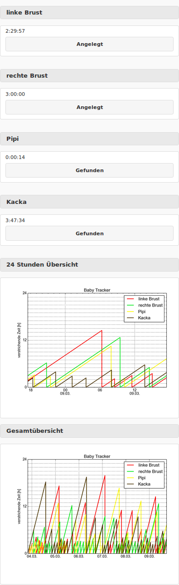

# Babytracker

<p align="center">

</p>

Babytracker is a small python based web app to keep track of your baby's "vital events" as shown (in German) in the screenshot. 

The python script itself is flexible vor anykind of events to track, you just have to add it in HTML/Javascript.

### Installation (debian)
It runs just fine on a raspberry pi. I had seperate webserver and graph plotter as the pi otherwise freezes after sometime (at least with the first-try code). So I use crontab to run both.

```sh
$ #Install dependencies
$ sudo apt-get update
$ sudo apt-get install python2.7 python-matplotlib python-pysqlite2 git
$
$ #Clone respository
$ git clone https://github.com/copyrights/babytracker.git
$
$ #Change directory and download jquery and jquery mobile
$ cd babytracker
$ wget http://code.jquery.com/jquery-2.2.1.min.js -O js/jquery.min.js
$ wget http://code.jquery.com/mobile/1.4.5/jquery.mobile-1.4.5.min.js -O js/jquery.mobile.min.js
$ wget http://code.jquery.com/mobile/1.4.5/jquery.mobile-1.4.5.min.css -O css/jquery.mobile.min.css
$
$ #Do a test run
$ python fakedata.py
$ python plot.py
$ python babytracker.py
$ #Browse to http://<server IP>:8000/
$ #If everything works fine you should stop babytracker.py (Ctrl+c)
$ #delete the fake db
$ rm bt.db
$ #and add crontabs for babytracker.py and plot.py
$ crontab -e

@reboot /path/to/babytracker.py
*/10 * * * * /path/to/plot.py

$ #Best to reboot here or start babytracker.py manual.
$ sudo reboot
```
